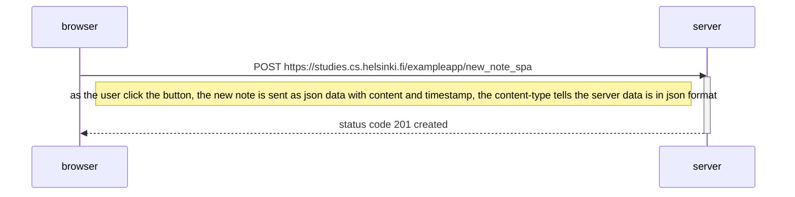

# create new note in single page app

```mermaid
sequenceDiagram
    participant browser
    participant server

    browser->>server: POST https://studies.cs.helsinki.fi/exampleapp/new_note_spa
    activate server

    note left of server: as the user click the button, the new note is sent as json data with content and timestamp, the content-type tells the server data is in json format

    server-->>browser: status code 201 created
    deactivate server
```